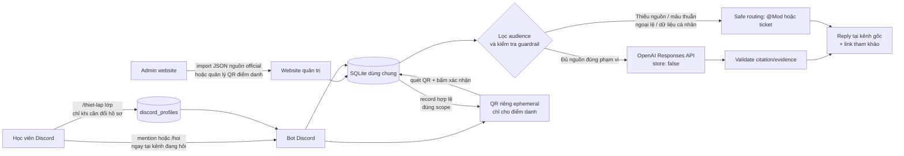

# JTBD workflow — Trợ lý Thực Chiến

## Job executor

Học viên AI20K đang tham gia Build Phase, thường tra cứu lúc cần nộp Daily, Mentor Duty, Workshop, Gate hoặc Lab.

## Workflow hiện tại

```text
Sắp đến việc nộp / phát sinh thắc mắc
        ↓
Tag bot hoặc tìm Discord / Phoenix / VLearn
        ↓
Có thông báo đúng và còn hiệu lực? ── Có → làm theo quy định
        │
        Không
        ↓
Hỏi lại / chờ Mod / tạo ticket
        ↓
Có nguy cơ trễ hạn, mất XP hoặc mất điểm danh
```

## Workflow đã triển khai trong server Discord

```text
Người học hỏi tại #general hoặc một kênh có bot
  (tag bot hoặc dùng /hoi; /thiet-lap chỉ cần làm khi muốn gắn lớp)
        ↓
Bot đọc hồ sơ lớp đã thiết lập: thực hành + lý thuyết
        ↓
SQLite lọc nguồn official theo audience
  all / 3A / 3A-E402 / 3A-E403 / 3A-D301
        ↓
Nguồn đúng lớp và đủ căn cứ? ── Có → OpenAI trả lời ngắn + citation/evidence
        │                                      ↓
        │                             Reply ngay tại chính kênh đang hỏi
        │
        Không / mâu thuẫn / ngoại lệ cá nhân / dữ liệu cá nhân
        ↓
Không đoán deadline → nêu giới hạn + hướng dẫn @Mod hoặc ticket
        ↓
Reply ngay tại chính kênh đang hỏi; không chuyển cuộc hỏi đáp sang DM
```

## Sơ đồ hệ thống và đường đi dữ liệu



### Quy tắc cần thấy được khi demo

1. Website **không** là một chatbot thứ hai: website chỉ là nơi admin import/quản lý nguồn official và phiên QR; bot luôn đọc cùng một SQLite ở lượt hỏi tiếp theo.
2. Câu hỏi ở `#general` được trả lời dưới chính tin nhắn đó. Không dùng DM cho hội thoại hỏi đáp; QR cá nhân là ngoại lệ riêng tư và trả dạng ephemeral.
3. Nguồn `3A-E402` không được xuất hiện trong câu trả lời cho E403 và ngược lại; nguồn `3A` dùng chung. Khi học viên E402 hỏi E403, bot không lấy nhầm nguồn.
4. D301 có hai deadline cho hai đầu việc khác nhau thì cả hai được liệt kê; chỉ hai nguồn mâu thuẫn về **cùng một đầu việc** mới phải chuyển @Mod.
5. QR scope riêng phải đối chiếu lớp trong hồ sơ Discord ở backend. Sau khi check-in hợp lệ, bot phản hồi lại tại chính interaction ephemeral; hồ sơ E402 không được ghi nhận vào phiên E403.

**Core JTBD:** Khi sắp nộp một hoạt động của AI20K, tôi muốn biết chính xác quy định hoặc mốc thời gian có căn cứ, để quyết định việc cần làm tiếp theo mà không bị mất XP, điểm danh hoặc lỡ hạn vì thông tin sai.
